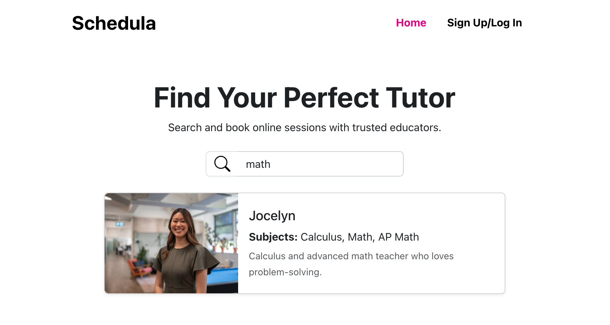
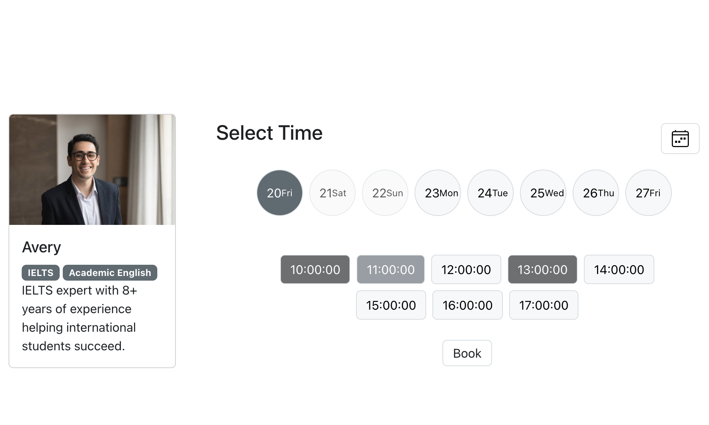
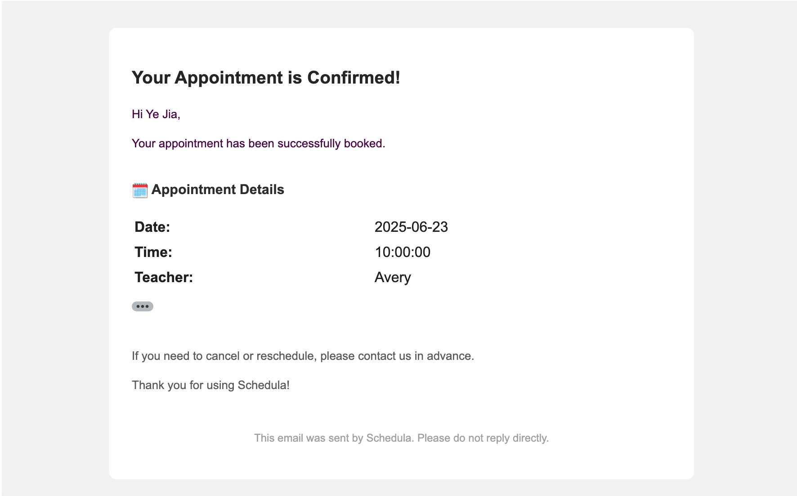
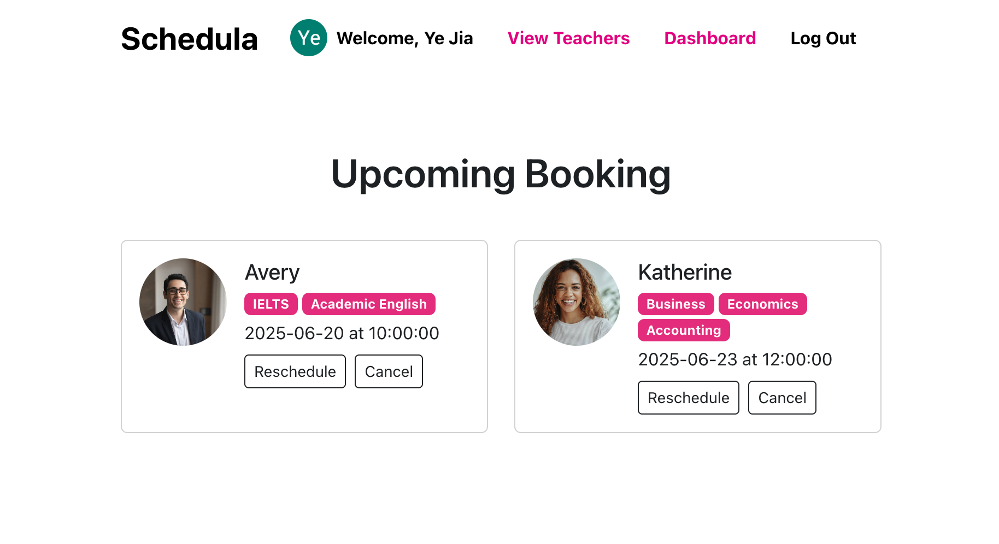
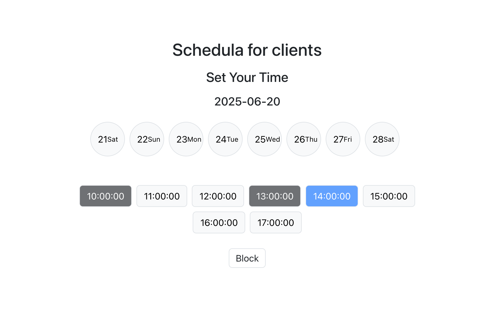
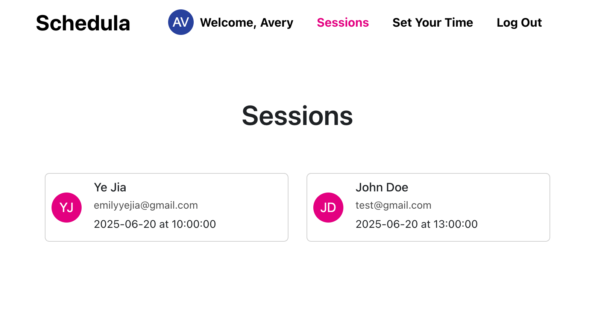

  

<h1 align="center">Schedula</h1>

  <a href="https://schedula-e653290ca365.herokuapp.com">CLICK TO PLAY</a>

## Description
Schedula is a modern scheduling platform that lets students discover and book sessions with trusted tutors in minutes. It offers:

- Flexible date selection with a local‑timezone calendar widget

- Real‑time availability showing booked and blocked time slots

- Teacher profiles complete with subjects, bios, and photos

- Easy rescheduling & cancellation workflows

Schedula streamlines the entire process—from finding the right tutor to confirming your session.

## Screenshot
| Description    | Screenshots                                      |
|---------------|-------------------------------------------------|
| Search     |  |
| Booking Page |  |
| Confirmation |  |
| Student Dashboard |  |
| Blocking Page     |  |
| Teacher Sessions  |  |

## Technologies Used
- React
- Bootstrap 5
- React-Datepicker
- Express.js
- MongoDB
- JSON Web Tokens
- Google OAuth 2.0
- Nodemailer
- Canada Holidays API
- UI Avatars API
- Google Map API

## Getting Started

### Instructions

1. Browse tutors
on the home page, filter by subject or name

2. View profiles
to see subjects, bio, and availability

3. Select a date
book an available time slot

4. Manage your appointments
under “Dashboard”—reschedule or cancel with one click.

### Link

- Deployed Link https://schedula-e653290ca365.herokuapp.com

## Upcoming Features

### Google Calendar Sync
Automatically add booked sessions to your external calendar.
### In‑App Video Chat
One‑click video conferencing built into each session.
### Ratings & Reviews
Students can rate tutors and leave feedback.